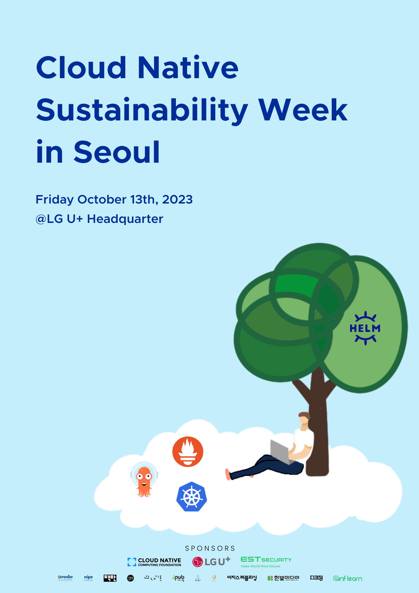

클라우드 네이티브의 환경 지속가능성♻️ 을 주제로 Cloud Native Sustainability in Seoul을 개최합니다 🎉

환경 지속가능성🌳 은 인류가 현재와 미래의 세대들이 건강하고 번영할 수 있는 지속 가능한 환경을 구축하는 데 초점을 맞춘 개념입니다.  

클라우드 컴퓨팅은 기업이 유연하고 안정적인 시스템을 구축할 수 있도록 도움을 주고 있지만, 에너지 소비로 인해 간접적으로 막대한 양의 탄소 배출을 유발하고 있습니다. 

CNCF(Cloud Native Computing Foundation)는 클라우드 네이티브 기술의 개발과 채택을 촉진하는 주체로서,  이러한 환경의 지속 가능성을 위해 기술적인 해결책, 가이드라인, 커뮤니티를 지원하고 있습니다.

이번 행사를 통해 클라우드 네이티브 환경의 지속 가능성에 대한 논의를 이어가고, 미래를 위한 지속 가능한 기술 개발에 대한 관심을 높이기를 기대합니다. 🌱

> 행사 주최: IT인프라 엔지니어 그룹, 오픈스택(오픈인프라) 한국 커뮤니티, 우분투한국커뮤니티

